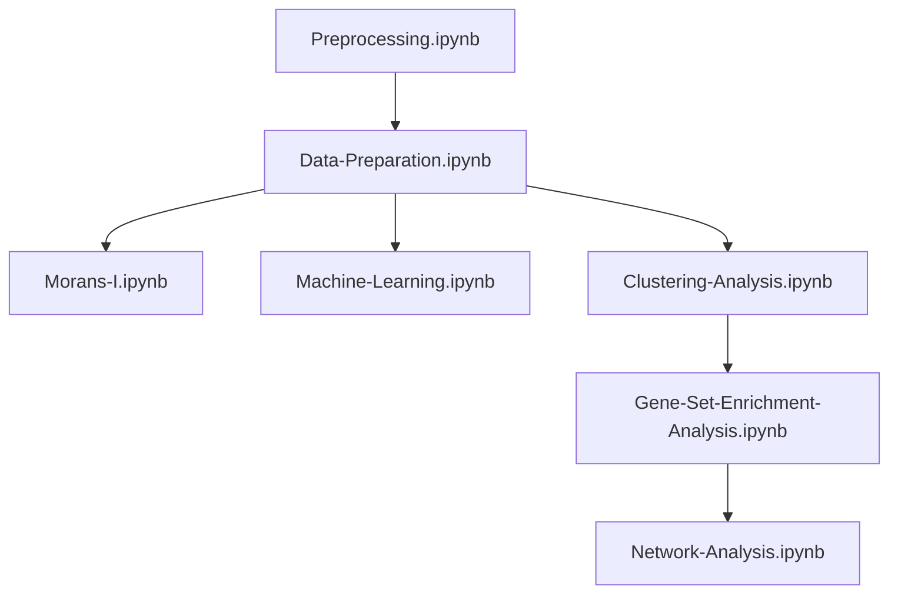

# Spatial Transcriptiomics Data Analysis

This repo is a codebase of "Spatial Transcriptomic Analysis of Macrophage Alterations in Vaping-Associated Pulmonary Injury" thesis. By following the below instruction thoroughly, one can reproduce all of the results and plots that were generated in the thesis.

## Setting up the environment

We used [miniconda3](https://docs.anaconda.com/free/miniconda/) as the package manager. Installation can be found [here](https://docs.anaconda.com/free/miniconda/miniconda-install/).

Change working direcotry to the local repo and create an environment from the ```setup_env.yaml``` file by running

```
$ conda env create -f setup_env.yaml
```

One can start Jupyter Notebook by running ```code .``` if using VS Code or ```jupyter notebook``` to launch the notebook locally.

## Data

The data can be found [here](https://www.ncbi.nlm.nih.gov/geo/query/acc.cgi?acc=GSE188805). However, it does not have the spatial information. The spatial information was provided by its owner from SDSU.

The gene counts and spatial coordinates are stored in ```raw_counts``` and ```spatial_coord``` folders in local repo, respectively.

## Notebook Details

In order to replicate the entire thesis, one should run the notebooks in this order.



In each notebook, I included a ```root_dict``` variable to store the root directory, make sure to change that to your root directory.
